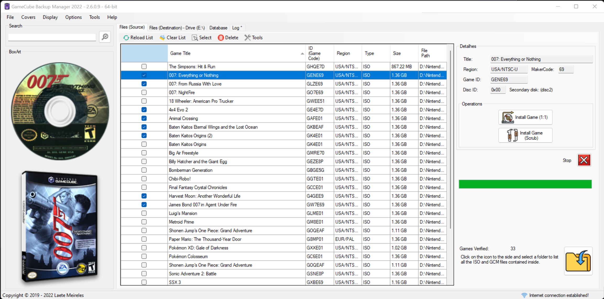
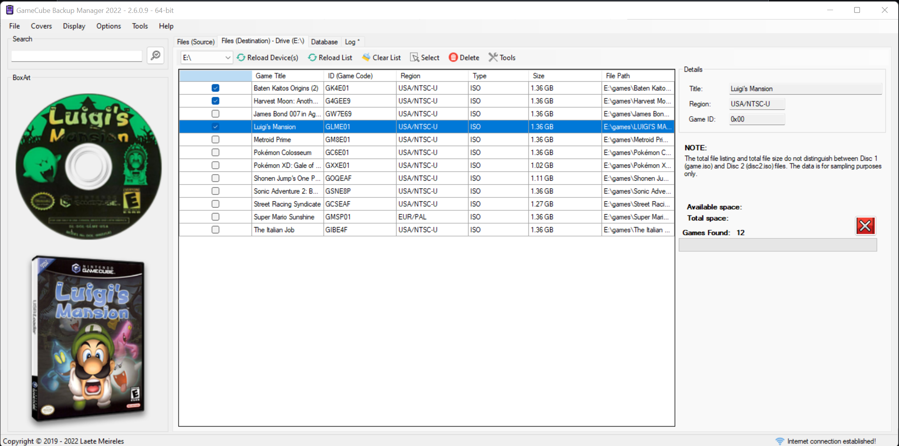
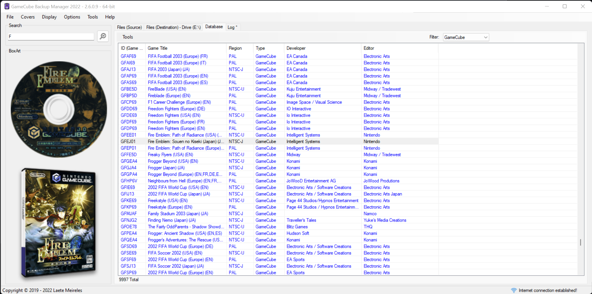

# GameCube Backup Manager

**GCBM (GameCube Backup Manager)** is a program for working with FAT32 *(and NTFS)* drives to convert ISO files for use in Nintendont.

Visit GameTDB, a collaborative game database for anyone to contribute and anyone to use in any game-related project. Just click on the link below (image):
* 

If you liked GameCube Backup Manager, feel free to donate any amount via PayPal. Just click on the link below (image):
* 

#### THE SOFTWARE IS PROVIDED "AS IS", WITHOUT WARRANTY OF ANY KIND, EXPRESS OR IMPLIED, INCLUDING BUT NOT LIMITED TO THE WARRANTIES OF MERCHANTABILITY, FITNESS FOR A PARTICULAR PURPOSE AND NONINFRINGEMENT. IN NO EVENT SHALL THE AUTHORS OR COPYRIGHT HOLDERS BE LIABLE FOR ANY CLAIM, DAMAGES OR OTHER LIABILITY, WHETHER IN AN ACTION OF CONTRACT, TORT OR OTHERWISE, ARISING FROM, OUT OF OR IN CONNECTION WITH THE SOFTWARE OR THE USE OR OTHER DEALINGS IN THE SOFTWARE.

### Download:
All Releases: https://github.com/AxionDrak/GameCube-Backup-Manager/releases

### Features:

+ Individual or batch file transfer (v2.5.0.0 or higher)
+ Reads ISO / GCM / NKit (ISO)
+ Writes ISO
+ Execution of multiple instances of the program.
+ Upload the 'wiitdb.xml' file in the 'Database' tab.
+ Automatic update system.
+ Proxy system.
+ Cover transfer (WiiFlow, WiiFlow Lite, WiiFlow Fusion).
+ Cover transfer (USB Loader GX, USB Loader GX Tab MOD).
+ Transferring games with the correct nomenclature (Game Name+ID or ID only).
***Available in “Install Game (1:1)” mode using the commercial name via ‘wiitdb.xml’. The “Install Game (Scrub)” mode uses the internal nomenclature provided by the developer, that is, it does not use ‘wiitdb.xml’.***
+ Game transfer via Scrub (GCReEx and DiscEx).
+ Deleting game files (Source and Destination).
+ Display of game information (region, publisher, genre, etc). ***File ‘wiitdb.xml’ required.***
+ ESRB ratings display. ***File ‘wiitdb.xml’ required.***
+ WiiTDB support for naming. ***File ‘wiitdb.xml’ required.***
+ Improved GameCube ISO detection (70% accuracy) in 'internal' (Standard) mode.
+ Improved GameCube ISO detection (100% accuracy) in 'business' mode (GameTDB). ***File ‘wiitdb.xml’ required.***
+ Global download of Disc and 3D covers (for all games listed!).
+ Individual download of covers for the selected game (Disc and 3D).
+ Game transfer via XCopy (1:1 copies - Standard).
+ Download the file 'wiitdb.xml' (GameTDB).
+ MD5 hash calculation.
+ SHA-1 Hash Calculation.
+ Automatic creation of 'games' folder (if it doesn't exist).
+ LOG system.
+ Multiple languages ​​supported:
  + Portuguese (Brazil)
  + English (United States)
  + Spanish (Spain)
  + Korean (Korea)
+ More polished and functional graphical interface (UI).

### Requirements
* .NET Framework 4.6
* Microsoft Windows 64-bit (32-bit not supported!)

### Screenshots

### Notes

+ The Wii and Wii U SD card slot is known to be slow. If you're using an SD card and are having performance issues, consider either using a USB SD reader or a USB hard drive (Highly recommended!).
+ USB flash drives are known to be problematic.
+ Nintendont runs best with storage devices formatted with 32 KB clusters. Use either FAT32 or exFAT (FAT32 highly recommended!). 
