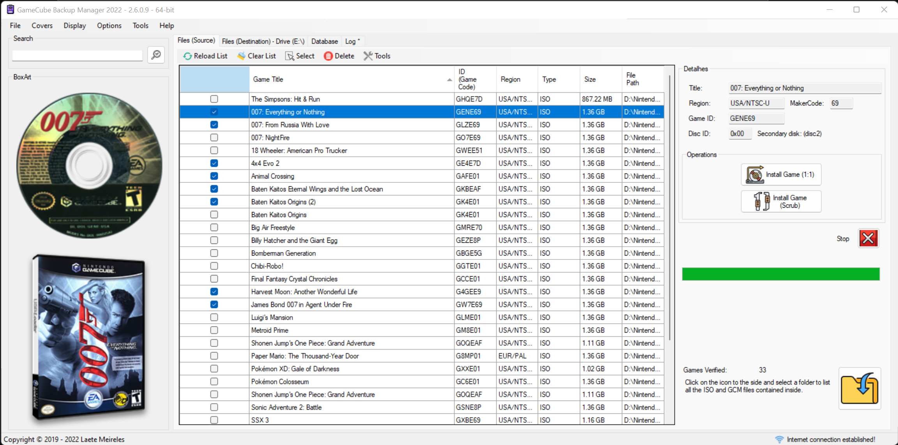
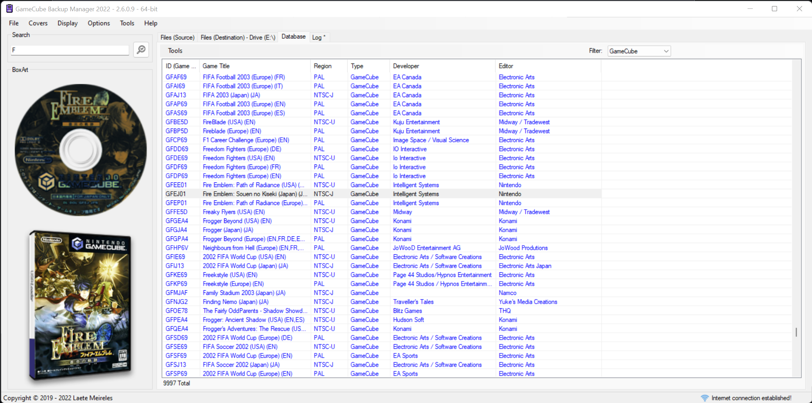
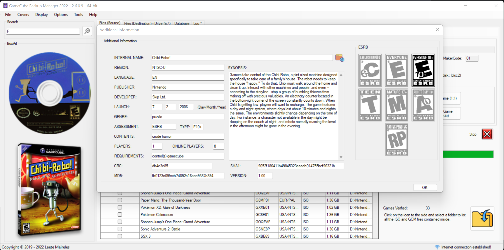

# その他のの言語
* [英語](README.md)
* [琉球諸語](README_RYU.md)

# GameCube Backup Manager

**GCBM (GameCube Backup Manager)** は、FAT32、exFAT、および NTFS ドライブで動作するプログラムです *(NTFS デバイスはバックアップとしてのみ動作し、Nintendontでは動作しません)* Nintendontで使用するためにISOファイルを正しく変換できます。

GameTDBにアクセスしてください。これは、誰でも貢献でき、誰でもゲーム関連のプロジェクトで使用できる共同ゲームデータベースです。下の画像をクリックするだけです（画像）：
* 

GameCube Backup Managerが気に入った場合は、PayPal経由で任意の金額を寄付してください。 下の画像をクリックするだけです（画像）：
* 

#### ソフトウェアは「現状有姿」で提供され、商品性、特定の目的への適合性、および非侵害の保証を含むがこれらに限定されない、明示または黙示を問わず、いかなる種類の保証もありません。 作者または著作権所有者は、契約、不法行為、またはその他の行為によるものであるかにかかわらず、本ソフトウェアまたは本ソフトウェアの使用またはその他の取引に起因または関連して、いかなる請求、損害、またはその他の責任に対しても責任を負わないものとします。

### ダウンロード：
全てのリリース： https://github.com/AxionDrak/GameCube-Backup-Manager/releases

### 特徴：

+ 個別またはバッチファイル転送（v2.5.0.0 以降）
+ ISO / GCM / NKitの読み取り（ISO のみ-GCZではありません）
+ ISOの書き込み
+ プログラムの複数のインスタンスの実行。
+ 「データベース」タブで「wiitdb.xml」ファイルをロードし、その内容をプレビューします （新しいゲームを発見するための良いオプションです！）
+ 自動更新システム
+ プロキシーシステム
+ カバーの転送（WiiFlow、WiiFlow Lite、WiiFlow Fusion）
+ カバーの転送（USB Loader GX、USB Loader GX Tab MOD）
+ 正しい名称でゲームを転送（ゲーム名 + IDまたはIDのみ）
***「wiitdb.xml」経由でゲーム名を使用して、「Install Game （1:1）」モードで利用できます。「Install Game (Scrub)」モードは、開発者によって提供された内部命の名前を使用します。つまり、「wiitdb.xml」は使用しません。***
+ XCopyによるゲーム転送 （1:1 コピー - 標準）
+ Scrub （GCReEx および DiscEx）によるゲーム転送
+ ゲームファイルの削除（ソースと宛先）
+ ゲーム情報（地域、パブリッシャー、ジャンルなど）の表示。 ***「wiitdb.xml」ファイルが必要です。***
+ ESRB評価の表示 ***「wiitdb.xml」ファイルが必要です。***
+ WiiTDBのネーミングのサポート。 ***「wiitdb.xml」ファイルが必要です。***
+ Improved GameCube ISO detection in 'internal' mode (Standard).
+ Improved GameCube ISO detection in 'external' mode (GameTDB). ***「wiitdb.xml」ファイルが必要です。***
+ Global download of Disc and 3D covers (for all games listed!).
+ Individual download of covers for the selected game (Disc and 3D).
+ Download the file 'wiitdb.xml' (GameTDB).
+ MD5 hash Calculation (manual option).
+ SHA-1 ハッシュ計算（手動オプション）
+ 「ゲーム」フォルダーの自動作成（存在しない場合）
+ ログシステム
+ 複数の言語をサポート：
  + ポルトガル語（ブラジル）
  + 英語（アメリカ）
  + スペイン語（スペイン）
  + 韓国語（韓国）
+ More polished and functional graphical interface (UI).

### 要件
* .NET Framework 4.6 (version 2.5.x.x or lower)
* .NET Framework 4.8 (version 2.6.x.x or higher)
* Microsoft Windows 64-bit (32-bit not supported!)

### スクリーンショット

### ノート

+ The Wii and Wii U SD card slot is known to be slow. If you're using an SD card and are having performance issues, consider either using a USB SD reader or a USB hard drive (Highly recommended!).
+ USB flash drives are known to be problematic.
+ Nintendont runs best with storage devices formatted with 32 KB clusters. Use either FAT32 or exFAT (FAT32 highly recommended!).
