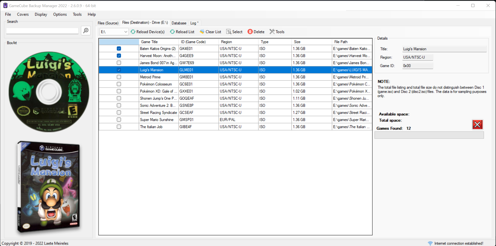

# すぬ他ぬ言語
* [英語](README.md)
* [やまとぅぐち](README_JP.md)

# GameCube Backup Manager

**GCBM (GameCube Backup Manager)** ー、FAT32、exFAT、うゆびNTFSドライブっし動作するプログラムやいびーん *(NTFS デバイスーバックアップとぅしてぃぬみ動作しー、Nintendontっしぇー動作さびらん)* Nintendontっし使用すんでぃISOファイル正しく変換なやびーん。

GameTDBんかいアクセスしみそーれー。くれー、たーやてぃん貢献ない、たーやてぃんゲーム関連ぬプロジェクトっし使用ないる共同ゲームデータベースやいびーん。しちゃぬ画像クリックすんがなやいびーん（画像）：
* 

GameCube Backup Managerが気に入たるばーや、PayPal経由っし任意ぬ金額寄付しみそーれー。 しちゃぬ画像クリックすんがなやいびーん（画像）：
* 

#### ソフトウェアー「現状有姿」っし提供されい、あちねーむん性、特定ぬ目的んかいぬ適合性、うゆび非侵害ぬ保証くくむしがくりらんかい限定さりらん、明示あらんでぃ黙示とぅーらじ、いかなる種類ぬ保証んあいびらん。 ちゅくやーあらんでぃ著作権所有者ー、契約、不法行為、あらんでぃすぬ他ぬ行為にゆるむんやんがんかいかかわらじ、本ソフトウェアあらんでぃ本ソフトウェアぬ使用あらんでぃすぬ他ぬ取引んかい起因あらんでぃ関連し、いかなる請求、損害、あらんでぃすぬ他ぬ責任に対してぃん責任かんだんむんとぅさびーん。

### ダウンロード：
まじりぬリリース： https://github.com/AxionDrak/GameCube-Backup-Manager/releases

### 特徴：

+ 個別あらんでぃバッチファイル転送（v2.5.0.0 以降）
+ ISO/GCM/NKitぬ読み取り（ISOぬみ-GCZっしぇーあいびらん）
+ ISOぬ書き込み
+ プログラムぬ複数ぬインスタンスぬ実行
+ 「データベース」タブっし「wiitdb.xml」ファイルロードしー、うぬ内容プレビューさびーん （みーさるゲーム発見するたみぬゆたさるオプションやいびーん！）
+ 自動更新システム
+ プロキシーシステム
+ カバーぬ転送（WiiFlow、WiiFlow Lite、WiiFlow Fusion）
+ カバーぬ転送（USB Loader GX、USB Loader GX Tab MOD）
+ 正しさる名称っしゲーム転送（ゲーム名 + IDあらんでぃIDぬみ）
***「wiitdb.xml」経由っしゲーム名使用し、「Install Game （1:1）」モードっし利用なやびーん。「Install Game (Scrub)」モードー、開発者にゆってぃ提供さったる内部ぬちぬなめー使用さびーん。ちまり、「wiitdb.xml」ー使用さびらん。***
+ XCopyにゆるゲーム転送 （1:1 コピー - 標準）
+ Scrub （GCReEx うゆび DiscEx）んかいゆるゲーム転送
+ ゲームファイルぬ削除（ソースとぅ宛先）
+ ゲーム情報（地域、パブリッシャー、ジャンルんでー）ぬ表示。 ***「wiitdb.xml」ファイルぬいりゆーやいびーん。***
+ ESRB評価ぬ表示 ***「wiitdb.xml」ファイルぬいりゆーやいびーん。***
+ WiiTDBぬネーミングぬサポート。 ***「wiitdb.xml」ファイルぬいりゆーやいびーん。***
+ 「内部」モード（標準）っしぬゲームキューブISO検出ぬ改善
+ 「外部」モード（GameTDB）っしぬゲームキューブぬISO検出ぬ改善 ***「wiitdb.xml」ファイルぬいりゆーやいびーん。***
+ ディスクとぅ3Dカバーぬグローバルダウンロード（リストさりとーるまじりぬゲーム用！）
+ 選択さるゲーム（ディスクうゆび3D）ぬカバーぬ個別ダウンロード
+ 「wiitdb.xml」ファイル（GameTDB）ぬダウンロード
+ MD5ハッシュさんみん（手動オプション）
+ SHA-1 ハッシュさんみん（手動オプション）
+ 「ゲーム」フォルダーぬ自動作成（存在さんばー）
+ ログシステム
+ 複数ぬ言語サポート：
  + ポルトガル語（ブラジル）
  + 英語（アメリカ）
  + スペイン語（スペイン）
  + 韓国語（韓国）
+ ゆり洗練さったる機能的なグラフィカルインターフェイス（UI）

### 要件
* .NET Framework 4.6（バージョン 2.5.x.x 以下)
* .NET Framework 4.8（バージョン 2.6.x.x 以降）
* Microsoft Windows 64-bit（32-bitーサポートさりやびらん！）

### スクリーンショット

### ノート

+ WiiうゆびWiiUぬSDカードスロットーにーさるくとぅが知らりとーいびーん。 SDカード使用そーてぃパフォーマンスんかい問題があるばーや、USB SDリーダーあらんでぃUSB ハードドライブぬ使用検討しみそーれー。（ちゅーくう勧めいさびーん！）
+ USB フラッシュドライブんかえー問題があるくとぅが知らりとーいびーん。
+ Nintendontー、32KBクラスターっしフォーマットさったるストレージデバイスっし最適んかい動作さびーん。 FAT32あらんでぃexFAT使用しみそーれー。（FAT32ちゅーくう勧めいさびーん!）

